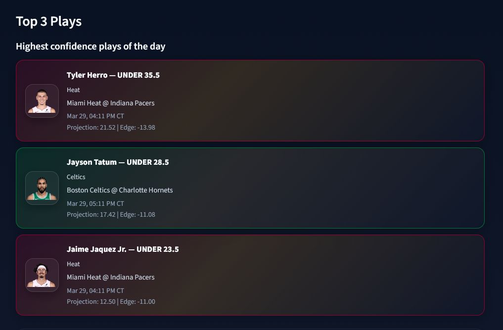

# NBA Player Performance Prediction

[](https://github.com/richardrhanly-us/NBA_Player_Performance_Data_Pipeline/actions/workflows/streamlit-health-check.yml)
[](https://github.com/richardrhanly-us/NBA_Player_Performance_Data_Pipeline/actions/workflows/python-check.yml)
[](https://edgeanalyticsnba.streamlit.app/)

A Python data pipeline and machine-learning application for analyzing NBA player performance and evaluating points-based betting props.

<p align="center">
  <a href="https://edgeanalyticsnba.streamlit.app/">
    
  </a>
</p>

---

## Overview

This project combines NBA game data, feature engineering, regression modeling, and an interactive Streamlit application into a complete player-performance prediction workflow.

The application allows users to:

- Search for an NBA player
- Review recent performance trends
- View the player’s current matchup when available
- Enter a proposed points line
- Generate a model-based scoring prediction
- Estimate the probability of finishing over or under the line
- Receive a simplified recommendation based on the predicted edge

The project was built to demonstrate an end-to-end data application rather than an isolated machine-learning notebook.

---

## Live Application

### [Launch NBA Player Performance Prediction](https://edgeanalyticsnba.streamlit.app/)

The application is deployed through Streamlit Community Cloud and monitored by a scheduled GitHub Actions health check.

Because NBA games are seasonal, live matchup information may be limited during the offseason. Historical player analysis and prediction features may still be available depending on the current data source.

---

## Key Features

### Player Search

Search for an NBA player and retrieve recent game-log information through the application interface.

### Performance Analysis

Review recent and long-term performance indicators, including scoring, shot volume, free-throw opportunities, minutes played, and overall game productivity.

### Model-Based Prediction

Generate an expected points total using a trained regression model and engineered player features.

### Prop-Line Evaluation

Enter a points line and compare it with the model prediction.

The application displays a simplified result:

- Lean Over
- Lean Under
- No Significant Edge

### Interactive Interface

The prediction model and supporting statistics are presented through a Streamlit web application designed for users who do not need to interact directly with Python code.

---

## Data Pipeline

The project follows this general workflow:

```text
NBA game logs
      ↓
Data collection
      ↓
Cleaning and validation
      ↓
Feature engineering
      ↓
Model training and evaluation
      ↓
Saved prediction model
      ↓
Streamlit application
      ↓
Player prediction and prop evaluation
```

---

## Model Features

The points-prediction model uses a focused set of historical and rolling player statistics.

| Feature | Purpose |
|---|---|
| `player_avg_pts` | Long-term scoring baseline |
| `last5_pts` | Recent scoring performance |
| `last5_fga` | Recent field-goal attempt volume |
| `last5_fta` | Recent free-throw opportunities |
| `last5_minutes` | Recent playing time and opportunity |
| `last5_gmsc` | Recent overall game productivity |

These features represent a combination of:

- Baseline player ability
- Recent form
- Offensive opportunity
- Playing time
- Overall involvement

---

## Machine-Learning Approach

The project uses tree-based regression models from scikit-learn, including:

- Random Forest Regression
- Gradient Boosting Regression

The selected model is trained on historical NBA game-log data and evaluated against unseen observations.

### Reported Model Performance

| Metric | Result |
|---|---:|
| Mean Absolute Error | Approximately 4.9 points |
| Root Mean Squared Error | Approximately 6.3 points |
| R² | Approximately 0.50 |

A mean absolute error of approximately 4.9 means that predictions differ from actual scoring results by about five points on average.

Performance can vary because of injuries, lineup changes, minutes restrictions, trades, rest days, and other factors that may not be represented fully in historical data.

---

## Example Output

<p align="center">
  
</p>

The application presents:

- Predicted player points
- User-entered betting line
- Difference between the prediction and line
- Estimated over and under probabilities
- Recent player statistics
- Model-generated recommendation

---

## Technology Stack

### Application

- Python
- Streamlit
- Pandas

### Data and APIs

- `nba_api`
- NBA player game logs
- REST-based data retrieval
- Google Sheets API

### Machine Learning

- scikit-learn
- Random Forest Regression
- Gradient Boosting Regression
- Feature engineering
- Regression evaluation

### Development and Automation

- Git
- GitHub
- GitHub Actions
- Streamlit Community Cloud

---

## Repository Structure

```text
NBA_Player_Performance_Data_Pipeline/
├── .github/
│   └── workflows/
├── .streamlit/
├── apps/
├── images/
├── models/
├── scripts/
├── src/
├── requirements.txt
└── README.md
```

---

## Running the Project Locally

### 1. Clone the repository

```bash
git clone https://github.com/richardrhanly-us/NBA_Player_Performance_Data_Pipeline.git
cd NBA_Player_Performance_Data_Pipeline
```

### 2. Create a virtual environment

#### Windows PowerShell

```powershell
py -3.11 -m venv .venv
.venv\Scripts\Activate.ps1
```

#### Linux or macOS

```bash
python3.11 -m venv .venv
source .venv/bin/activate
```

### 3. Install dependencies

```bash
python -m pip install --upgrade pip
python -m pip install -r requirements.txt
```

### 4. Start the Streamlit application

```bash
python -m streamlit run apps/publicapp.py
```

---

## GitHub Actions

This repository uses two automated workflows.

### Streamlit Health Check

The deployment health workflow periodically requests the Streamlit health endpoint and verifies that the public application is responding.

```text
.github/workflows/streamlit-health-check.yml
```

### Python Code Check

The Python workflow validates the repository’s Python files and confirms that core dependencies can be installed and imported.

```text
.github/workflows/python-check.yml
```

---

## Engineering Highlights

This project demonstrates experience with:

- Building repeatable data pipelines
- Integrating third-party APIs
- Cleaning and transforming sports data
- Engineering rolling statistical features
- Training and evaluating regression models
- Saving and loading trained model artifacts
- Building an interactive Python web application
- Deploying through Streamlit Community Cloud
- Monitoring a live deployment with GitHub Actions
- Organizing a multi-directory Python repository
- Presenting technical results to nontechnical users

---

## Limitations

NBA player performance is affected by factors that may not be fully represented by historical game logs, including:

- Injuries
- Starting-lineup changes
- Minutes restrictions
- Trades
- Rest days
- Coaching decisions
- Opponent defensive strategy
- Overtime
- Late-breaking roster information

The model should be treated as an analytical tool rather than a guarantee of future performance.

Probability estimates are model-derived approximations and are not equivalent to sportsbook probabilities or guaranteed outcomes.

---

## Future Improvements

- Add opponent defensive-rating features
- Add home and away splits
- Integrate injury and lineup-status data
- Improve expected-minutes modeling
- Add back-to-back and rest-day indicators
- Add position-specific matchup data
- Automate model retraining
- Expand automated testing
- Add model-version tracking
- Add prediction-history dashboards
- Support additional player statistics beyond points

---

## Disclaimer

This project is intended for educational, analytical, and portfolio purposes.

It does not provide financial advice, guarantee betting outcomes, or replace independent research and responsible decision-making.

---

## Author

**Richard Hanly**

[LinkedIn](https://www.linkedin.com/in/richardhanly/) ·
[GitHub](https://github.com/richardrhanly-us) ·
[Live Application](https://edgeanalyticsnba.streamlit.app/)
